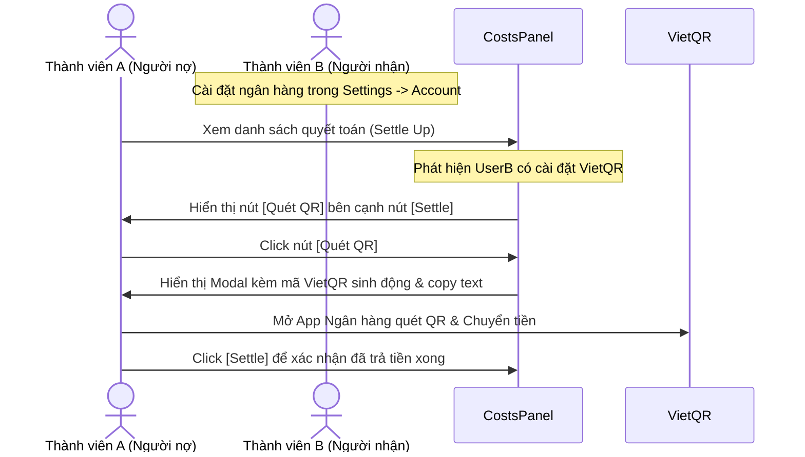

# Đặc tả Thiết kế: Việt hóa & Bản địa hóa Tripp (Vietnam Localization & VietQR Integration)

Tài liệu này đặc tả thiết kế hệ thống cho các tính năng bản địa hóa Tripp sang thị trường Việt Nam bao gồm: Mặc định tiền tệ VND, mặc định bản đồ Việt Nam, và tích hợp quét mã QR chuyển khoản ngân hàng tự động (VietQR).

---

## 1. Mặc định Tiền tệ VND & Định dạng tiền tệ kiểu Việt Nam

### Mục tiêu
Thay vì mặc định là EUR hoặc USD, toàn bộ hệ thống sẽ chuyển sang sử dụng VND khi người dùng tạo chuyến đi mới hoặc tạo tài khoản mới. Đồng thời, định dạng hiển thị tiền tệ VND cần tuân theo chuẩn Việt Nam.

### Chi tiết thay đổi
1. **Client-side Settings Store (`client/src/store/settingsStore.ts`):**
   * Đổi `default_currency` thành `'VND'`.
   * Đổi `dashboard_fx_from` thành `'VND'`.
2. **Server-side Trip Service (`server/src/services/tripService.ts`):**
   * Đổi giá trị mặc định của chuyến đi mới từ `'EUR'` thành `'VND'`.
3. **Formatters Helper (`client/src/utils/formatters.ts`):**
   * Bổ sung mapping `'VND': 'vi-VN'` trong bảng định dạng của `currencyLocale`.
   * Đảm bảo hiển thị dạng: `150.000 ₫`.

---

## 2. Mặc định Bản đồ Việt Nam

### Mục tiêu
Khi người dùng tạo chuyến đi mới mà chưa thêm địa điểm hoặc bản đồ hiển thị ở trạng thái trống, bản đồ sẽ mặc định tập trung vào Việt Nam thay vì Châu Âu.

### Chi tiết thay đổi
* **Tọa độ trung tâm:** Đà Nẵng, Việt Nam `[16.0471, 108.2062]`.
* **Zoom Level:** `6` (hiển thị trọn vẹn bản đồ Việt Nam).
* **Các file cập nhật:**
  * [MapView.tsx](file:///Users/nhatminh/Desktop/TREK/client/src/components/Map/MapView.tsx): Sửa `center` mặc định thành `[16.0471, 108.2062]` và `zoom` mặc định thành `6`.
  * [MapViewGL.tsx](file:///Users/nhatminh/Desktop/TREK/client/src/components/Map/MapViewGL.tsx): Sửa tương tự.
  * [settingsStore.ts](file:///Users/nhatminh/Desktop/TREK/client/src/store/settingsStore.ts): Đổi `default_lat` mặc định thành `16.0471`, `default_lng` thành `108.2062` và `default_zoom` thành `6`.

---

## 3. Tích hợp Quét mã VietQR Chia tiền tự động

### Mục tiêu
Cho phép người dùng thiết lập tài khoản ngân hàng cá nhân và tự động sinh mã QR chuyển khoản ngân hàng (chuẩn VietQR/Napas247) kèm theo Số tiền và Nội dung chuyển khoản khi quyết toán chi phí.

### Luồng nghiệp vụ

### Chi tiết Thiết kế Giao diện

#### A. Cài đặt Tài khoản Ngân hàng (Settings -> Account)
Thêm Section mới `Thông tin thanh toán (VietQR)` vào [AccountTab.tsx](file:///Users/nhatminh/Desktop/TREK/client/src/components/Settings/AccountTab.tsx):
* **Ngân hàng:** Menu dropdown chứa các ngân hàng lớn hỗ trợ VietQR:
  * Vietcombank (`vcb`)
  * Techcombank (`tcb`)
  * MB Bank (`mbb`)
  * VietinBank (`ctg`)
  * BIDV (`bidv`)
  * ACB (`acb`)
  * TPBank (`tpb`)
  * VPBank (`vpb`)
  * Sacombank (`stb`)
  * VIB (`vib`)
  * Agribank (`vba`)
* **Số tài khoản:** Trường nhập số.
* **Tên chủ tài khoản:** Trường nhập text, tự động chuẩn hóa sang chữ IN HOA không dấu.
* **Lưu trữ:** Lưu vào bảng `settings` thông qua API bulk update `/settings/bulk`.

#### B. Modal Quét QR (Costs Panel - Settle Up)
Khi click vào nút `QR` trên dòng quyết toán của người nhận (`B`), ứng dụng sẽ mở một hộp thoại chứa:
1. **QR Code Động (VietQR.io API):**
   * Định dạng URL:
     `https://img.vietqr.io/image/<BANK_ID>-<ACCOUNT_NO>-compact.png?amount=<AMOUNT>&addInfo=<DESCRIPTION>&accountName=<ACCOUNT_NAME>`
   * **Nội dung chuyển khoản (addInfo):** Định dạng dạng không dấu để tránh lỗi hiển thị trên một số hệ thống ngân hàng Việt Nam:
     `[Ten nguoi gui] ck chuyen di [Ten chuyen di]`
     *Ví dụ: `Nhat Minh ck chuyen di Phu Quoc 2026`*
2. **Text chi tiết giao dịch:** Hiển thị Tên ngân hàng, Số tài khoản, Chủ tài khoản, Số tiền, Nội dung để người dùng có thể sao chép nhanh (`Copy to Clipboard`) bằng nút bấm tiện lợi.

---

## 4. Kế hoạch xác minh (Verification Plan)

### Kiểm thử thủ công
1. Vào Settings -> Account, cấu hình tài khoản ngân hàng thử nghiệm và lưu lại.
2. Vào một Chuyến đi (Trip) có từ 2 thành viên trở lên, thêm chi phí để xuất hiện số dư nợ chéo.
3. Ở trang Chi phí (Costs), kiểm tra xem nút `QR` có hiển thị bên dòng nợ của người đã cài đặt ngân hàng hay không.
4. Nhấp vào nút `QR`, kiểm tra Modal hiện ra xem ảnh QR code có hiển thị chính xác và các thông tin (Số tài khoản, Tên, Số tiền, Nội dung không dấu) có khớp không.
5. Quét thử bằng ứng dụng ngân hàng thực tế để đảm bảo app ngân hàng nhận đúng thông tin chuyển khoản.
